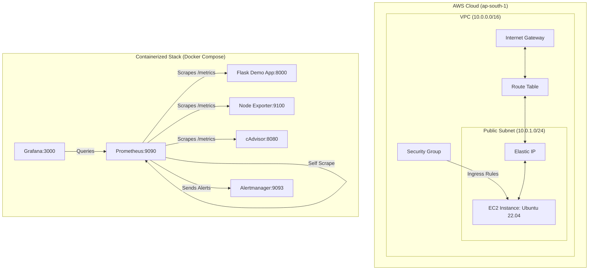

# Cloud Infrastructure Monitoring with Prometheus & Grafana

A portfolio-ready, fully-automated DevOps monitoring stack that provisions AWS infrastructure using Terraform and deploys a containerized monitoring system (Prometheus, Grafana, Alertmanager, Node Exporter, and cAdvisor) to monitor a custom-instrumented Python Flask application.

---

## Live Deployments

* **DevOps Control Center Dashboard**: [https://dev-cloud-monitoring.vercel.app/](https://dev-cloud-monitoring.vercel.app/)
* **Instrumented Demo Application**: [https://cloud-monitoring-app.vercel.app/](https://cloud-monitoring-app.vercel.app/)
* **Prometheus Metrics Feed**: [https://cloud-monitoring-app.vercel.app/metrics](https://cloud-monitoring-app.vercel.app/metrics)

---

## Architecture Overview



---

## Key Features

* **Infrastructure as Code**: Modular Terraform configuration to provision AWS Virtual Private Clouds (VPC), public subnets, internet gateways, route tables, elastic IPs, and security groups.
* **Automated Provisioning**: EC2 bootstrapping via cloud-init user data to configure the container runtime environment.
* **Unified Metrics Collection**: Multi-tier telemetry ingestion combining host-level metrics (Node Exporter), container performance metrics (cAdvisor), and application-level custom metrics (Flask with Prometheus client).
* **Automated Visualizations**: Pre-configured Grafana dashboards with provisioned Prometheus data sources for CPU, Memory, Disk I/O, Container usage, and HTTP request rates/latencies.
* **Proactive Alerting**: Alertmanager integration with Prometheus alerting rules for automated incident detection.
* **Interactive Control Center**: Cross-platform, responsive monitoring dashboard with live telemetry feeds, real-time HTTP load generation, auto-traffic simulation, and dynamic backend switching.

---

## Stack Components

| Component | Port | Description |
| :--- | :--- | :--- |
| **Prometheus** | `:9090` | Time-series database that periodically scrapes metric endpoints |
| **Grafana** | `:3000` | Visualization and analytics platform with pre-provisioned dashboards |
| **Alertmanager** | `:9093` | Alert routing, grouping, and notification engine |
| **Node Exporter** | `:9100` | Host hardware and OS metrics collector (CPU, memory, disk, network) |
| **cAdvisor** | `:8080` | Container resource usage and performance metrics collector |
| **Flask Demo App** | `:8000` | Custom Python service exposing Prometheus HTTP metrics and latency histograms |

---

## Alerting Rules

| Rule Name | Severity | Condition | Threshold |
| :--- | :--- | :--- | :--- |
| **InstanceDown** | Critical | Target service unreachable | `up == 0` for 1 minute |
| **HostHighCpuLoad** | Warning | Host CPU utilization exceeds threshold | CPU usage > 80% for 5 minutes |
| **HostHighMemory** | Warning | Host memory utilization exceeds threshold | Free memory < 15% for 5 minutes |

---

## Repository Directory Structure

```text
├── .gitignore          # Git exclusion patterns
├── README.md           # Project documentation and architecture
├── RUNBOOK.md          # Alert response and operational runbook
├── vercel.json         # Vercel deployment and routing configuration
├── requirements.txt    # Python root dependencies
├── /api
│   └── index.py        # Serverless backend entrypoint
├── /dashboard
│   └── index.html      # DevOps Control Center responsive dashboard
├── /demo-app
│   ├── app.py          # Instrumented Flask service with Prometheus metrics
│   ├── requirements.txt# Service dependencies
│   └── Dockerfile      # Container definition for application service
├── /monitoring
│   ├── docker-compose.yml   # Multi-container stack configuration
│   ├── prometheus.yml       # Prometheus scrape and rule configuration
│   ├── alert_rules.yml      # Alert definitions
│   ├── alertmanager.yml     # Alertmanager routing and receivers
│   └── /grafana
│       └── /provisioning
│           ├── /datasources
│           │   └── datasource.yml  # Prometheus datasource configuration
│           └── /dashboards
│               ├── dashboard.yml   # Dashboard provider configuration
│               └── monitoring_dashboard.json # Custom dashboard panels
└── /terraform
    ├── main.tf         # AWS compute and network resource declarations
    ├── variables.tf    # Input variable declarations
    ├── outputs.tf      # Infrastructure outputs
    ├── providers.tf    # Provider configurations
    └── terraform.tfvars.example  # Configuration template
```