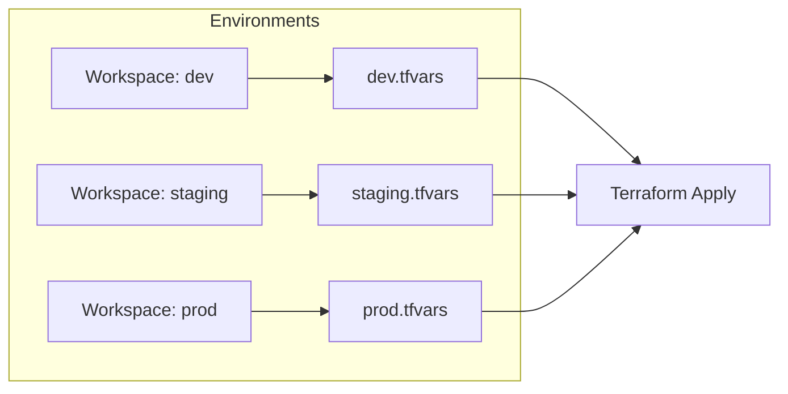
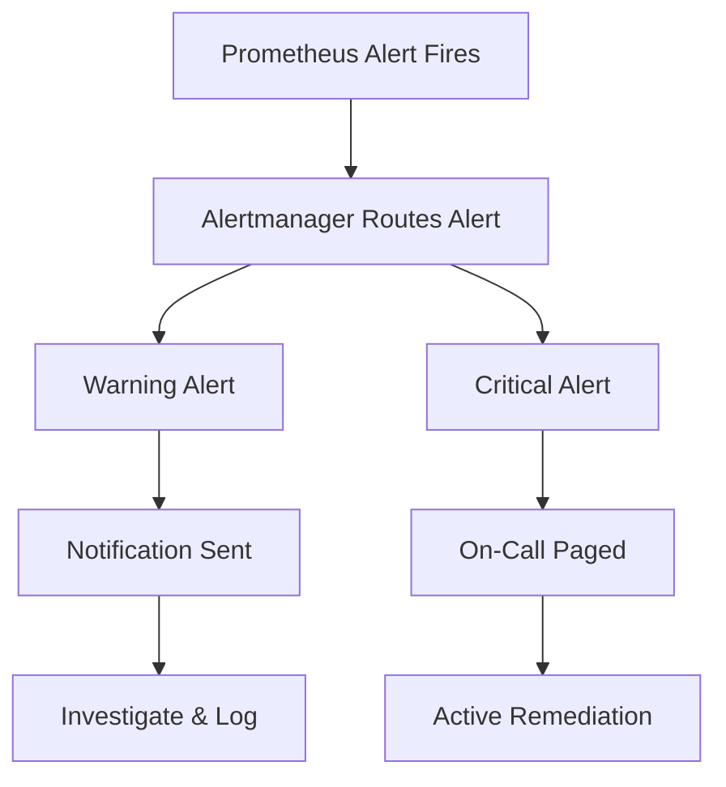

# Runbook & Operations Guide

This runbook guides you through deploying to multiple environments, tearing down infrastructure safely, and responding to infrastructure alerts generated by Prometheus.

---

## 1. Multi-Environment Deployments (Dev, Staging, Prod)

To manage different environments safely and prevent configuration drift, we use **Terraform Workspaces** combined with environment-specific `.tfvars` files.

### Workflow Example



### Steps to Deploy to a Specific Environment

1. Navigate to the `/terraform` folder:
   ```bash
   cd terraform
   ```

2. Create or switch to the environment workspace:
   ```bash
   # Switch to dev
   terraform workspace select dev || terraform workspace new dev
   ```

3. Create your custom environment configurations (e.g. `dev.tfvars`, `prod.tfvars`):
   * **`dev.tfvars`**:
     ```hcl
     aws_region     = "ap-south-1"
     instance_type  = "t3.micro"
     project_name   = "devops-monitoring-dev"
     allowed_cidr   = "0.0.0.0/0"
     ```
   * **`prod.tfvars`**:
     ```hcl
     aws_region     = "ap-south-1"
     instance_type  = "t3.medium"
     project_name   = "devops-monitoring-prod"
     allowed_cidr   = "198.51.100.12/32" # Restricted to corporate office/VPN IP
     ```

4. Run plan using the target environment variable file:
   ```bash
   terraform plan -var-file="dev.tfvars"
   ```

5. Apply the configuration:
   ```bash
   terraform apply -var-file="dev.tfvars" -auto-approve
   ```

---

## 2. Infrastructure Teardown Flow

To avoid unwanted AWS billing charges, clean up your infrastructure safely when it is no longer required.

### Safe Teardown Steps

> [!CAUTION]
> Running `terraform destroy` will immediately terminate your EC2 instances, drop your Elastic IPs, and delete your VPCs. Any non-persistent container volumes will be lost.

1. Navigate to the `/terraform` folder in the correct workspace:
   ```bash
   cd terraform
   terraform workspace select dev
   ```

2. Execute a destroy plan preview:
   ```bash
   terraform plan -destroy -var-file="dev.tfvars"
   ```

3. Apply the destroy command:
   ```bash
   terraform destroy -var-file="dev.tfvars" -auto-approve
   ```

4. Clean up local state backups and dynamic keys (Optional):
   ```bash
   rm -f monitoring-key.pem terraform.tfstate*
   ```

---

## 3. Alert Response Protocols (Prometheus Alerts)

This section maps out the operational steps required when each Prometheus alert fires.



---

### Alert 1: `InstanceDown`

> [!IMPORTANT]
> **Severity**: Critical  
> **Trigger condition**: Target (Prometheus, node-exporter, cAdvisor, or demo-app) has been unreachable/down for more than 1 minute.

#### Triage Steps
1. **Identify the missing target**: Check the alert payload label or open Prometheus UI (`http://<instance_ip>:9090/targets`) to see which job is down.
2. **Check server reachability**: Ping the EC2 instance's Elastic IP. If the server does not respond:
   * Access the AWS Console -> EC2 dashboard and check the instance state.
   * Verify if the instance failed AWS system status checks. Reboot the instance if necessary.
3. **Verify container daemon/status**: If the host is reachable but containers are failing:
   * SSH into the server:
     ```bash
     ssh -i monitoring-key.pem ubuntu@<elastic_ip>
     ```
   * Inspect container processes:
     ```bash
     docker compose ps
     ```
   * Restart any failed containers:
     ```bash
     docker compose restart <service_name>
     ```
4. **Examine application container logs**:
   ```bash
   docker compose logs -f demo-app
   ```

---

### Alert 2: `HostHighCpuLoad`

> [!WARNING]
> **Severity**: Warning  
> **Trigger condition**: Host CPU utilization exceeds 80% for more than 5 minutes continuously.

#### Triage Steps
1. **Analyze CPU metrics**: Open the Grafana dashboard (`http://<instance_ip>:3000`) and look at the "Host CPU Usage" panel to verify if it is a transient spike or sustained load.
2. **Identify heavy processes**: SSH into the server and run `htop` or `top` sorted by CPU usage:
   ```bash
   ssh -i monitoring-key.pem ubuntu@<elastic_ip>
   top -o %CPU
   ```
3. **Check container metrics**:
   * Inspect container CPU shares using `docker stats` or look at the "Container CPU Usage" panel in Grafana to isolate which container is consuming resources.
4. **Remediation**:
   * If the custom `demo-app` is looping, restart it: `docker compose restart demo-app`.
   * If it is a legitimate resource bottleneck, consider upgrading the EC2 instance type (e.g. from `t3.micro` to `t3.small`) in your `terraform.tfvars`.

---

### Alert 3: `HostHighMemory`

> [!WARNING]
> **Severity**: Warning  
> **Trigger condition**: Host Memory usage exceeds 85% for more than 5 minutes continuously.

#### Triage Steps
1. **Analyze Memory panels**: Open the Grafana dashboard and review the "Host Memory Usage" trend.
2. **Identify memory leak/offender**: SSH into the server and run `top` or `ps` sorted by memory consumption:
   ```bash
   ssh -i monitoring-key.pem ubuntu@<elastic_ip>
   top -o %MEM
   ```
3. **Check container memory constraints**:
   * Run `docker stats` to verify memory limits of running containers.
4. **Remediation**:
   * Restart the offending process or container.
   * Consider implementing container memory limits in `/monitoring/docker-compose.yml` to prevent a single container from causing an Out-Of-Memory (OOM) killer event on the host:
     ```yaml
     deploy:
       resources:
         limits:
           memory: 512M
     ```
   * Upgrade instance memory if memory usage is persistently high due to normal application scaling.
